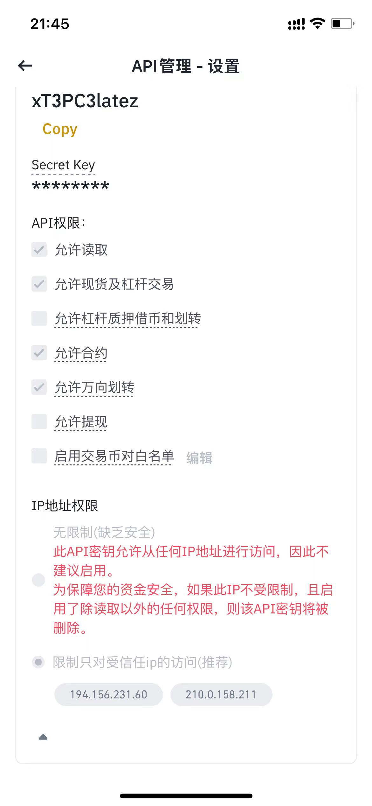

# 币安资金费率套利系统

## 运行模式

### 模式一

如果拥有自己的服务器，程序跑在你自己的服务器，推荐使用Linux系统。

只需要发送服务器的mac地址，到我的邮箱lyyhello2018@gmail.com，我发送程序到你邮箱，协助你跑起来。

推荐使用这种方式，这样是最安全的。

### 模式二

如果没有自己的服务器，就需要使用我提供的服务器来跑。

需要发送 api_key，api_secret到我的邮箱地址lyyhello2018@gmail.com。

程序跑在我的服务器上，需要注意api的授权，**不能给提现权限**。

## 收费标准

### 模式一

按月付费，每月5日，收取最近一个月资金费率收益的10%，100U封顶。

### 模式二

按月付费，每月5日，收取最近一个月资金费率收益的15%，150U封顶。

## 策略参数

如果程序跑在我的服务器上，那么参数就由我来把控。

如果程序跑在你自己的服务器上，那么你可以自己调整策略参数。

## 币安账号注册

如果是新用户，使用我的推荐码，那么收费可以打8折。

币安邀请码: 111042837

币安邀请链接: https://accounts.suitechsui.io/register?ref=111042837

## 币安API key设置

如图所示，千万不要勾选运行提现。

需要设置可以访问的ip地址。

## 联系方式

扫码添加微信，备注 资金费率进群。

