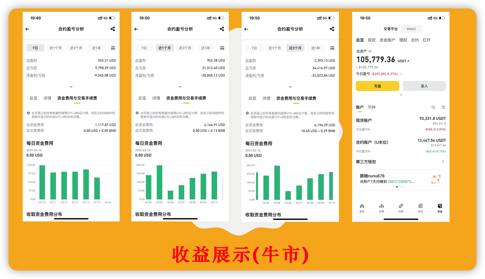
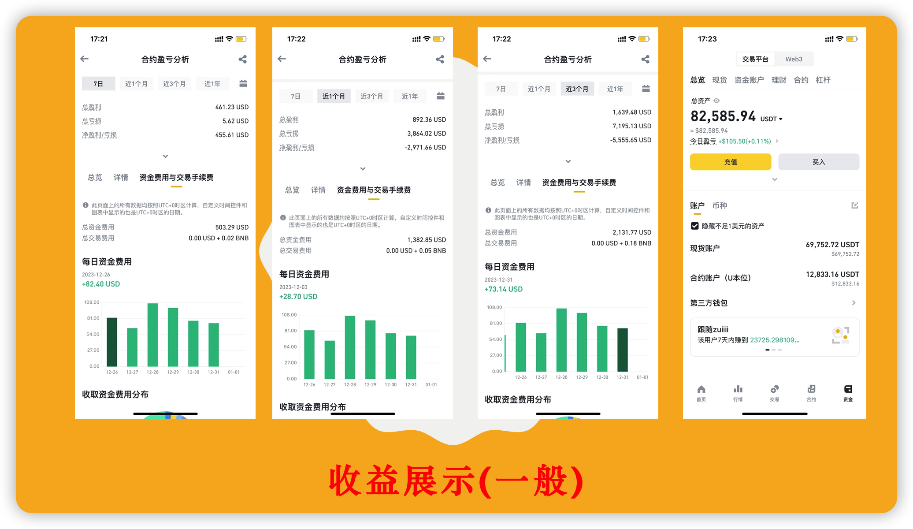

# 资金费率套利系统

文章末尾有我的联系方式，大家可以先加上。

我会不定期以会议的方式分享整个资金费率套利系统的原理、实际操作。

联系我，深入了解他，带走他，使用他。

## 收益展示

### 牛市行情

### 一般行情

## 收费标准

**费用金额计算**:最近一个月资金费率收益的10%，金额不足10U,按10U收取。

**收取时间**:按月付费，每月5日收取。

**支付方式**:可以直接微信转账或者转U。

**服务器费用**:按年收取,30U/年。

如果你有自己的服务器，可以发送程序给你，你自己运行程序。

不需要支付服务器费用。

## 基础实操

### 币安账户

#### 账号注册

凡使用我的推荐码注册的用户，后续所有收费一律**8折**优惠。

**币安邀请码**: 111042837

**币安邀请链接**:https://accounts.suitechsui.io/register?ref=111042837

#### APP下载

**币安APP下载地址**:https://www.binance.com/en/download

**身份认证**  需要使用身份证认证

**账户安全设置** 谷歌验证器、邮箱验证

#### 子账户创建

使用普通邮箱创建子账号，只有普通邮箱创建的子账户，APP端才支持独立登录。

需要创建全新的子账户来运行策略，保证资金隔离。

参考币安官网指导 

https://www.binance.com/zh-CN/support/faq/%E5%B8%81%E5%AE%89%E5%AD%90%E8%B4%A6%E6%88%B7%E5%8A%9F%E8%83%BD%E5%8F%8A%E5%B8%B8%E8%A7%81%E9%97%AE%E9%A2%98%E8%A7%A3%E7%AD%94-360020632811

#### 子账户开通合约

点击开通合约账户

#### 母账户转账到子账户

从母账户转入需要投入的usdt到子账户的现货账户中

#### 子账户合约交易设置

APP登录子账户。

点击合约，交易界面设置合约  默认双向持仓 修改为 **单向持仓** 

**这里必须设置，不然合约下单会报错。**

#### 设置BNB抵扣手续费

#### 子账户api设置

子账户在app端登录，首页搜索api管理。

需要设置可以访问的ip地址

**勾选允许的操作** 包括 允许读取、运行现货及杠杆交易、允许合约、允许万向划转。

#### 检查项

1、使用普通邮箱创建子账户

2、子账户开通合约账户

3、从母账户转入usdt到子账户现货账户

4、设置单向持仓

5、设置使用bnb抵扣手续费

6、设置api 设置ip地址

 7、设置api 勾选允许的操作 允许读取、运行现货及杠杆交易、允许合约、允许万向划转

### 服务器

欢迎使用我的推荐码注册购买服务器。

**链接地址**:https://www.ucloud.cn/site/active/kuaijiesale.html?invitation_code=C1x3530AD5B9371

**服务器节点**:新加坡

**服务器配置**:1核2g

**服务器系统版本:** Centos 8.3

**操作切图**

### 软件运行

把我发给你的软件解压，直接上传到服务器/root目录

chmod +x fund_rate_main

chmod +x fund_rate.sh

#### 程序启动

./fund_rate.sh start  

#### 程序重启

./fund_rate.sh restart 

#### 程序停止

./fund_rate.sh stop

## Q/A

### 多少资金可以跑策略

金额没有限制。

因为需要支付软件使用费，建议金额需要大于10000U。

低于10000U，在熊市的时候收益覆盖软件使用费之后，所剩无几。

### 进阶理解

#### 核心原理

#### 软件参数

#### 软件日志

## 视频讲解

[币安|资金费率|套利系统 收益展示](https://youtu.be/PqYYekkzBsg?si=WfiaYej6JGb3cr-v)

## 联系方式

### Telegram

https://t.me/+A39VMFzjeCViYTdl

### 微信

扫码添加微信，备注 资金费率进群。

