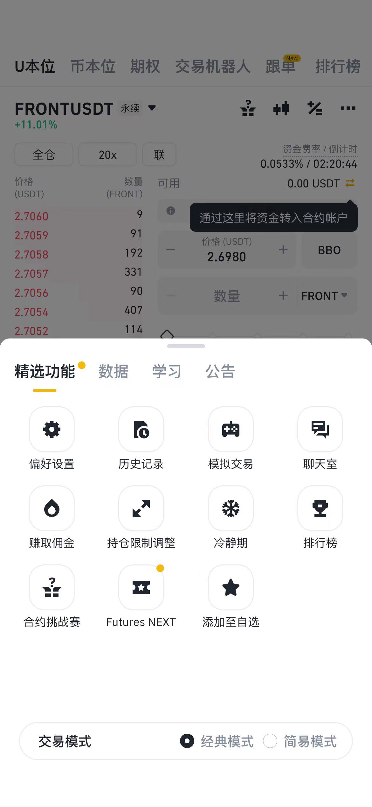
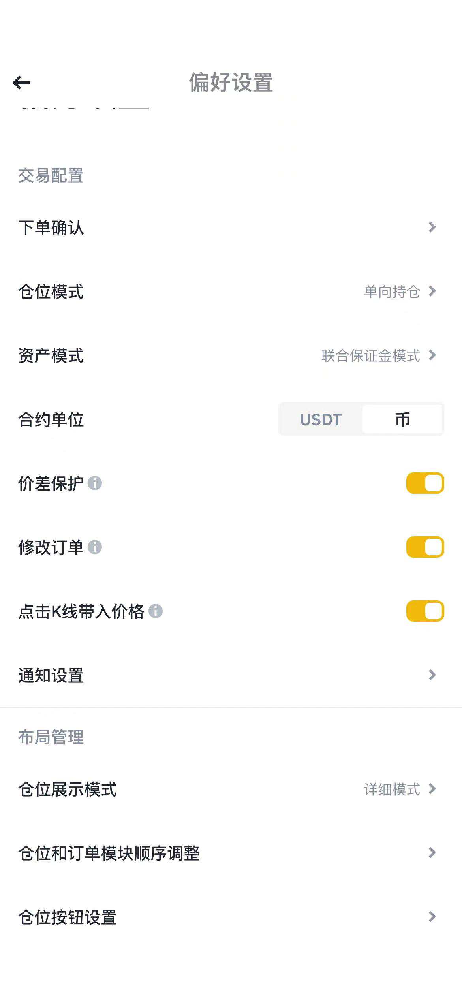
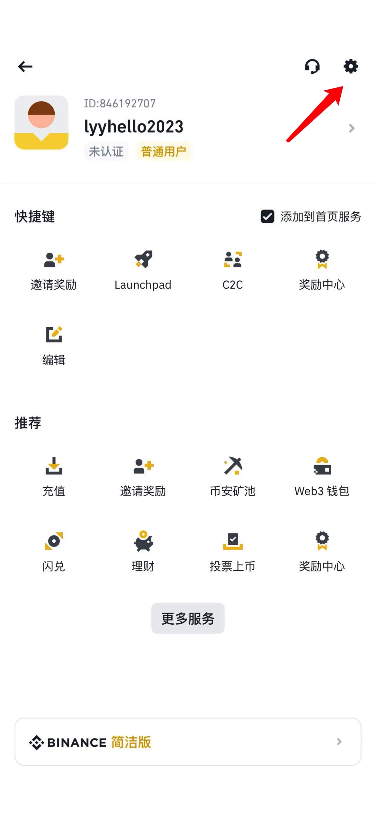
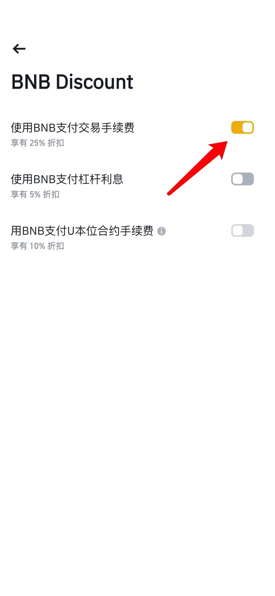
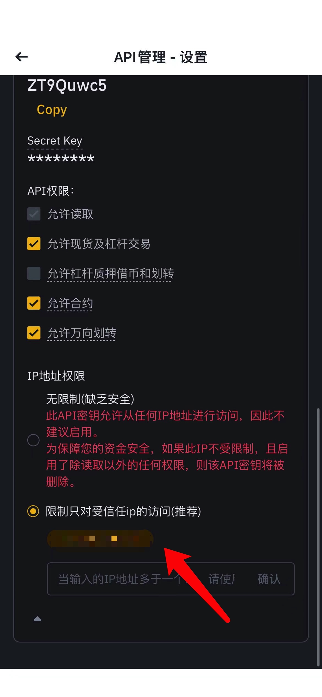

# 资金费率套利系统

## 目录

- [收益展示](#收益展示)
  - [牛市行情](#牛市行情)
  - [一般行情](#一般行情)
- [收费标准](#收费标准)
- [币安账户](#币安账户)
  - [账户注册](#账户注册)
  - [APP下载](#APP下载)
  - [子账户](#子账户)
    - [子账户创建](#子账户创建)
    - [子账户开通合约](#子账户开通合约)
    - [母账户划转资金到子账户](#母账户划转资金到子账户)
    - [子账户合约交易设置](#子账户合约交易设置)
    - [子账户设置BNB抵扣手续费](#子账户设置BNB抵扣手续费)
    - [子账户API设置](#子账户API设置)
    - [子账户检查项](#子账户检查项)

- [服务器](#服务器)
  - [连接工具](#连接工具)

- [软件运行](#软件运行)
  - [启动](#启动)
  - [停止](#停止)
  - [重启](#重启)

- [进阶](#进阶)
  - [核心原理](#核心原理)
  - [软件参数](#软件参数)
  - [软件日志](#软件日志)

- [Q/A](#Q/A)
  - [多少资金可以跑策略](#多少资金可以跑策略)

- [视频讲解](#视频讲解)
- [联系方式](#联系方式)
  - [TG](#TG)
  - [微信](#微信)

## 收益展示

### 牛市行情

### 一般行情

## 收费标准

**费用金额计算**:最近一个月资金费率收益的10%，金额不足10U,按10U收取。

**收取时间**:按月付费，每月5日收取。

**支付方式**:可以直接微信转账或者转U。

**服务器费用**:按年收取,30U/年。

如果你有自己的服务器，可以发送程序给你，你自己运行程序。

不需要支付服务器费用。

## 币安账户

### 账户注册

**币安邀请码**: 111042837

**币安邀请链接**:https://accounts.suitechsui.io/register?ref=111042837

### APP下载

**币安APP下载地址**:https://www.binance.com/en/download

**身份认证**  需要使用身份证认证

**账户安全设置** 谷歌验证器、邮箱验证

### 子账户

#### 子账户创建

使用普通邮箱创建子账号，只有普通邮箱创建的子账户，APP端才支持独立登录。

需要创建全新的子账户来运行策略，保证资金隔离。

参考币安官网指导 

https://www.binance.com/zh-CN/support/faq/%E5%B8%81%E5%AE%89%E5%AD%90%E8%B4%A6%E6%88%B7%E5%8A%9F%E8%83%BD%E5%8F%8A%E5%B8%B8%E8%A7%81%E9%97%AE%E9%A2%98%E8%A7%A3%E7%AD%94-360020632811

#### 子账户开通合约

点击开通合约账户

#### 母账户划转资金到子账户

从母账户转入需要投入的usdt到子账户的现货账户中

#### 子账户合约交易设置

使用APP登录子账户

点击合约，交易界面点击 **【偏好设置】**

合约模式  默认双向持仓 修改为 **单向持仓** 

**这里必须设置，不然合约下单会报错。**

#### 子账号设置BNB抵扣手续费

红箭头所示，点击齿轮图标

选择BNB折扣

打开使用BNB支付交易手续费

#### 子账户API设置

子账户在app端登录，首页搜索api管理。

需要设置可以访问的ip地址

记录下 api_key和api_secret

**勾选允许的操作** 包括 允许读取、运行现货及杠杆交易、允许合约、允许万向划转。

#### 子账户检查项

1、使用普通邮箱创建子账户

2、子账户开通合约账户

3、从母账户转入usdt到子账户现货账户

4、设置单向持仓

5、设置使用bnb抵扣手续费

6、设置api 设置ip地址

 7、设置api 勾选允许的操作 允许读取、运行现货及杠杆交易、允许合约、允许万向划转

## 服务器

欢迎使用我的推荐码注册购买服务器。

**链接地址**:https://www.ucloud.cn/site/active/kuaijiesale.html?invitation_code=C1x3530AD5B9371

**服务器节点**:香港、新加坡

**服务器配置**:1核2g

**服务器系统版本:** Centos 8.3

**操作切图**

### 连接工具

强大的终端管理工具，支持各个端，免费版。

Termius:https://www.termius.com/download/

## 软件运行

把我发给你的软件解压，直接上传到服务器/root目录

chmod +x fund_rate_main

chmod +x fund_rate.sh

### 启动

./fund_rate.sh start  

### 停止

./fund_rate.sh stop

### 重启

./fund_rate.sh restart 

## 进阶

#### 核心原理

#### 软件参数

#### 软件日志

## Q/A

### 怎么理解现货、合约、杠杆?

现货:买BTC，拥有BTC，可以提到钱包。

合约:对BTC（现货）价格上涨和下跌看法的分歧

做多:认为BTC价格马上要上涨,买入

做空:认为BTC价格马上要下跌,卖出

交易所:撮合做多和做空交易。

有做多，必然有对手做空，所以做空是意义的，牛市的时候，给以小博大的人，提供对手盘。

杠杆:收益和风险的放大器，杠杆能够放大你账户里面U的购买力，当你超额购买BTC的时候，放大了风险。
杠杆的倍数不是风险来源。

而是你开仓的数量价值的金额，和你合约账户的保证金余额之间的差额，这个才是真正的风险。

### 利润的由来？

赚钱:通过合约做空，每天三次收取的资金费用。

亏钱:交易手续费,未来减少交易手续费，不能够频繁交易。

币价上涨:合约亏钱，现货赚钱，由于数量一致，金额对冲。

币价下跌:合约赚钱，现货亏钱，由于数量一致，金额对冲。

### 资金安全方面的保障？ 

资金在你自己子账户的。安全由币安和你自己保证。
我给你软件，帮你自动下单。
子账号授权API没有提现功能的。

### 多少资金可以跑策略？

软件试用,建议金额大于2000U。

正式付费使用，建议金额大于10000U。

### 如何保证不爆仓?

设置合约5倍杠杆，倍数支持配置。

挑选上线时间大于60天的币种，天数支持配置，不做新币。

挑选资金费率前60的品种，数量支持配置，分散风险。

检查每个品种的持仓金额，大于规定的金额就会平仓。规定金额是动态计算的。

监控合约持仓的风险敞口率。不同敞口率配置不同的开仓和平仓条件。

风险利率越高，平仓条件越低，就会触发平仓。

现货和合约之间U的余额是动态划转的。保持可用余额接近。

## 视频讲解

[币安资金费率套利-实操讲解](https://youtu.be/Q5oT1Hj5VHM?si=8v4Zr6Ijmd64dsgi):https://youtu.be/Q5oT1Hj5VHM?si=8v4Zr6Ijmd64dsgi

## 联系方式

### TG
订阅:https://t.me/fund_rate_arbitrage

群组:https://t.me/fund_rate_arbitrage_group

### 微信

扫码添加微信,备注 资金费率

