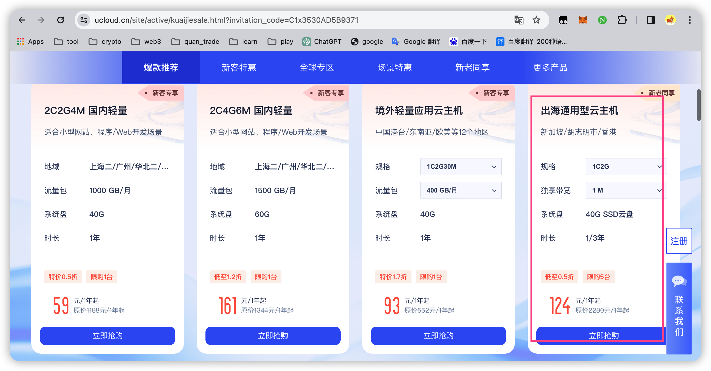
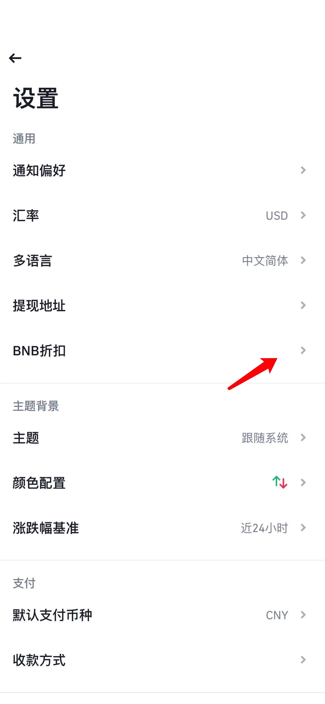

# 资金费率套利系统

## 目录

- [服务器](#服务器)
- [币安账户](#币安账户)
  - [账户注册](#账户注册)
  - [APP下载](#APP下载)
  - [子账户](#子账户)
    - [子账户激活](#子账户激活)
    - [子账户创建](#子账户创建)
    - [子账户开通合约](#子账户开通合约)
    - [母账户划转资金到子账户](#母账户划转资金到子账户)
    - [子账户API设置](#子账户API设置)
    - [子账户合约交易设置单向持仓、联合保证金模式 ](#子账户合约交易设置单向持仓、联合保证金模式 )
    - [子账户设置BNB抵扣手续费](#子账户设置BNB抵扣手续费)
    - [子账户检查项](#子账户检查项)
- [连接工具](#连接工具)
- [软件运行](#软件运行)
  - [上传](#上传)
  - [启动](#启动)
  - [停止](#停止)
  - [查看状态](#查看状态)
- [Q/A](#Q/A)

  - [怎么理解现货、合约、杠杆?](#怎么理解现货、合约、杠杆?)
  - [利润的由来？](#利润的由来？)
  - [资金安全方面的保障？ ](#资金安全方面的保障？ )
  - [多少资金可以跑策略？](#多少资金可以跑策略？)
  - [如何保证不爆仓?](#如何保证不爆仓?)
- [联系方式](#联系方式)
  - [TG](#TG)
  - [微信](#微信)


## 服务器

如果直接托管，软件运行在我的服务器上，不需要自己购买服务器。

如果需要软件在你自己的服务器上运行，欢迎使用我的推荐码注册购买服务器。

购买服务器，需要实名认证。大概在10分钟左右完成认证。

**链接地址**:https://www.ucloud.cn/site/active/kuaijiesale.html?invitation_code=C1x3530AD5B9371

**服务器节点**:香港、新加坡

**服务器配置**:1核2g

**服务器系统版本:** Centos 8.3

**操作切图**




## 币安账户

### 账户注册

**币安邀请码**: 111042837

**币安邀请链接**:https://accounts.suitechsui.io/register?ref=111042837


### APP下载

**币安APP下载地址**:https://www.binance.com/en/download

**身份认证**  需要使用身份证认证

**账户安全设置** 谷歌验证器、邮箱验证


### 子账户

#### 子账户激活

需要在PC端激活子账户


#### 子账户创建

使用普通邮箱创建子账号，只有普通邮箱创建的子账户，APP端才支持独立登录。

为了资金的隔离，每个子账户只能用一个策略，而且不能手动操作买卖。


#### 子账户开通合约

点击开通合约账户


#### 母账户转入资金到子账户

从母账户转入需要投入的usdt到子账户的现货账户中


#### 子账户API设置

记录下 api_key和api_secret。

设置可以访问的ip地址，就是服务器那一节讲解的外网IP地址。

**勾选允许的操作** 包括 允许读取、运行现货及杠杆交易、允许合约、允许万向划转。


#### 子账户合约交易设置单向持仓、联合保证金模式 

使用APP登录子账户，底部切换到合约交易界面


点击更多【**···**】


点击**偏好设置**


合约模式  默认双向持仓 修改为 **单向持仓** 

资产模式 设置成 **联合保证金模式**

**这里必须设置，不然合约下单会报错。**


#### 子账号设置BNB抵扣手续费

红箭头所示，点击设置图标


红箭头所示，选择BNB折扣




红箭头所示，打开使用BNB支付交易手续费


#### 子账户检查项

1、使用普通邮箱创建子账户

2、子账户开通合约账户

3、从母账户转入usdt到子账户现货账户

4、设置api 设置ip地址

5、设置api 勾选允许的操作 允许读取、运行现货及杠杆交易、允许合约、允许万向划转

6、设置单向持仓、联合保证金模式

7、设置使用bnb抵扣手续费


## 连接工具

强大的终端管理工具，支持各个端，免费版。

Termius:https://www.termius.com/download/


## 软件运行

### 上传

使用SFTP上传，把fund_rate目录，直接上传到服务器/root目录

```shell
chmod +x fund_rate_main
chmod +x fund_rate.sh
```

### 启动

```shell
./fund_rate.sh restart 
```

### 停止

```shell
./fund_rate.sh stop
```


### 查看状态

```shell
# tail
tail -108f fund_rate/log/fund_rate.log

#grep
grep -n "系统开始" fund_rate/log/fund_rate.log | tail -n 1 | awk -F: '{print $1}' | xargs -I {} tail -n +{} fund_rate/log/fund_rate.log | head -n 68
```


## Q/A

### 怎么理解现货、合约、杠杆?

现货:买BTC，拥有BTC，可以提到钱包。

合约:对BTC（现货）价格上涨和下跌看法的分歧

做多:认为BTC价格马上要上涨,买入

做空:认为BTC价格马上要下跌,卖出

交易所:撮合做多和做空交易。

有做多，必然有对手做空，所以做空是意义的，牛市的时候，给以小博大的人，提供对手盘。

杠杆:收益和风险的放大器，杠杆能够放大你账户里面U的购买力，当你超额购买BTC的时候，放大了风险。
杠杆的倍数不是风险来源。

而是你开仓的数量价值的金额，和你合约账户的保证金余额之间的差额，这个才是真正的风险。


### 利润的由来？

赚钱:通过合约做空，每天三次收取的资金费用。

亏钱:交易手续费,为了减少交易手续费，不能够频繁交易。

币价上涨:合约亏钱，现货赚钱，由于数量一致，金额对冲。

币价下跌:合约赚钱，现货亏钱，由于数量一致，金额对冲。


### 资金安全方面的保障？ 

资金在你自己子账户的。安全由币安和你自己保证。
我给你软件，帮你自动下单。
子账号授权API没有提现功能的。


### 多少资金可以跑策略？

10000U。


### 如何保证不爆仓?

设置合约5倍杠杆，倍数支持配置。

挑选上线时间大于60天的币种，天数支持配置，不做新币。

挑选资金费率前60的品种，数量支持配置，分散风险。

检查每个品种的持仓金额，大于规定的金额就会平仓。规定金额是动态计算的。

监控合约持仓的风险敞口率。不同敞口率配置不同的开仓和平仓条件。

风险利率越高，平仓条件越低，就会触发平仓。

现货和合约之间U的余额是动态划转的。保持可用余额接近。


## 联系方式

### TG
订阅:https://t.me/fund_rate_arbitrage

群组:https://t.me/fund_rate_arbitrage_group


### 微信

添加好友请备注 **资金费率**


