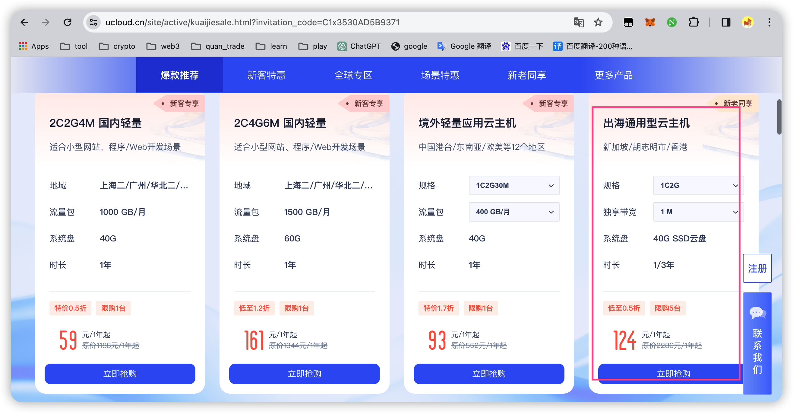
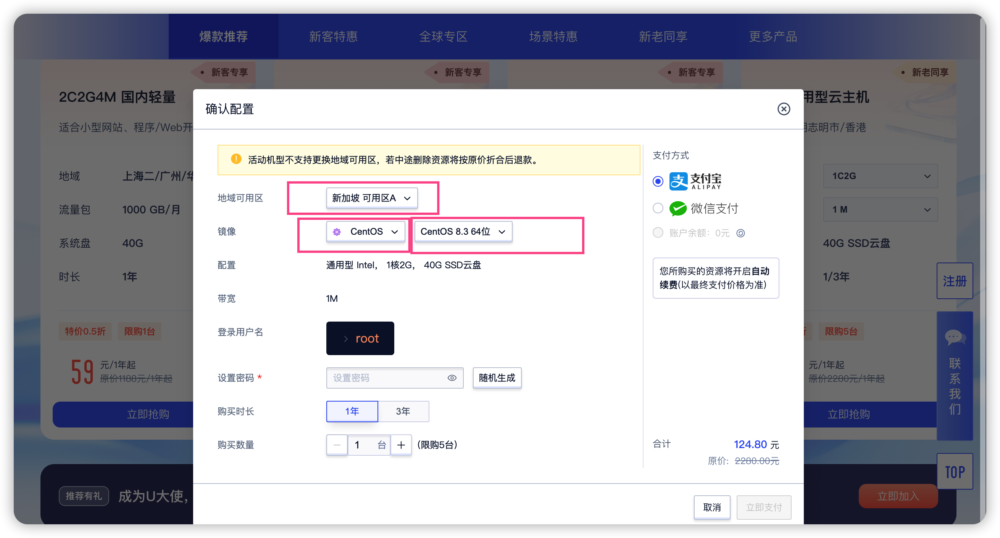

# 服务器

## 服务器选购

需要独立运行软件的用户，欢迎使用我的推荐码注册购买服务器。

购买服务器，需要实名认证。大概10分钟左右完成认证。

**链接地址**:https://www.ucloud.cn/site/active/kuaijiesale.html?invitation_code=C1x3530AD5B9371

**服务器节点**:优先选择香港、其次选择新加坡

**服务器配置**:1核2g

**服务器系统版本:** Centos 8.3

**操作切图**







## 连接工具

强大的终端管理工具，支持各个手机和电脑。

Termius下载地址:https://www.termius.com/download/


## 软件运行(资金费率套利系统)

### 上传

使用SFTP上传，把fund_rate目录，直接上传到服务器/root目录

```shell
chmod +x fund_rate_main
chmod +x fund_rate.sh
```

### 启动

```shell
./fund_rate.sh restart 
```

### 停止

```shell
./fund_rate.sh stop
```


### 查看状态

```shell
# tail
tail -108f fund_rate/log/fund_rate.log

#grep
grep -n "系统开始" fund_rate/log/fund_rate.log | tail -n 1 | awk -F: '{print $1}' | xargs -I {} tail -n +{} fund_rate/log/fund_rate.log | head -n 68
```

