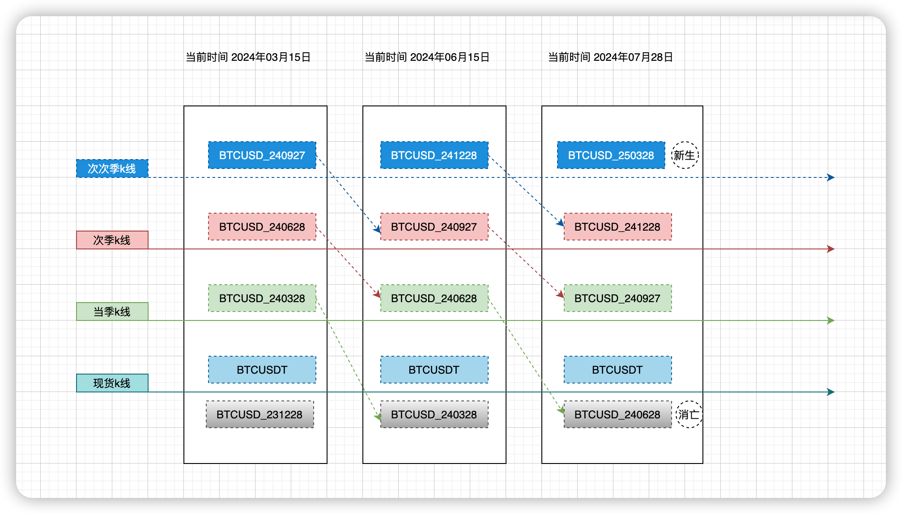

# 期现价差套利系统

## 多少资金可以跑策略？

50000U

## 资金安全保障？ 

资金存放在子账户，子账号授权API没有提现功能。

## 利润的由来？

当季交易对,BTCUSD_240628在6月28日到期，其价格会回归等于BTCUSDT现货价格。

在当季交易对BTCUSD_240628和现货交易对BTCUSDT价差达到预设的值，买入现货BTC，转入币本位合约，卖出相同数量BTCUSD_240628做空。

等到交割日附近，价差回归。再平掉空单，转入到现货账户，卖出现货。

收益就是开单时候的价差。

## 收费标准？

年化预估：12%+

订阅付费：198U/季

收益提成：收益金额*10%

收益提成＜订阅付费，只需支付订阅付费

收益提成 ≥ 订阅付费，只需支付收益提成

收费周期：按季计费，当季交割后结算当季

## 源代码出售?

6WU,师傅带徒弟，提供一对一技术教学和指导，基础解惑+源码解读+实盘跟踪。

